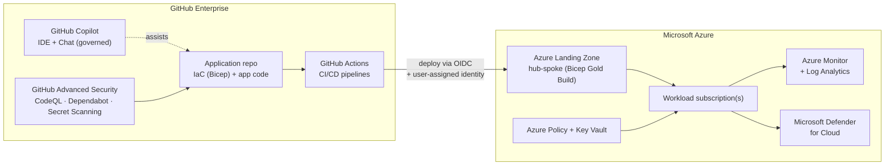
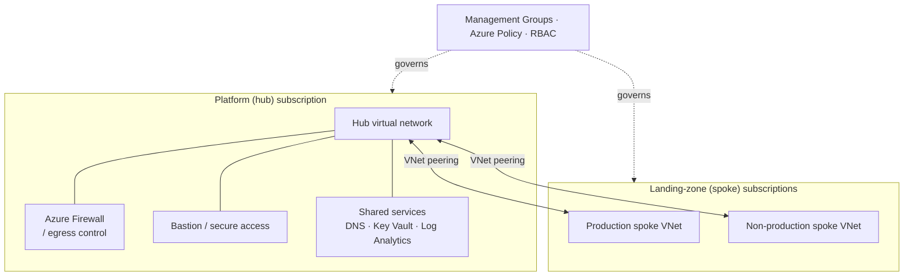
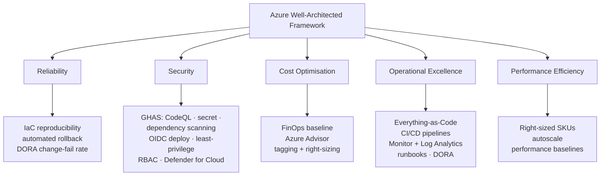

# FSP — DevSecOps Practice

> **Agentic DevOps with Microsoft Azure and GitHub.** Repeatable, secure, evidence-first software delivery — by Foundation Specialist Partner (FSP).

[-0078D4)](https://partner.microsoft.com/)

---

## Table of contents

- [What we do](#what-we-do)
- [Why this matters](#why-this-matters)
- [Capability matrix](#capability-matrix)
- [Operating principles](#operating-principles)
- [Reference architecture](#reference-architecture)
- [Secure delivery pipeline](#secure-delivery-pipeline)
- [Azure Well-Architected alignment](#azure-well-architected-alignment)
- [Engagement model](#engagement-model)
- [Certifications](#certifications)
- [Get in touch](#get-in-touch)

---

## What we do

We help organisations adopt **secure, automated software delivery on Microsoft Azure** using the GitHub platform — Enterprise, Actions, Advanced Security (GHAS) and Copilot. Our practice is operated against the Microsoft Azure Specialisation **Agentic DevOps with Microsoft Azure and GitHub (v2.6)** as our internal quality bar — even where engagements do not require formal certification.

> **Core promise:** every customer outcome is **measurable, auditable, and reproducible**. If we cannot evidence it from a pipeline run or an exported artefact, we treat it as not done.

---

## Why this matters

Most cloud-delivery problems are not technology problems — they are **operating-model** problems. Teams that ship safely on Azure share four traits, and our engagements are designed around them:

1. **Single source of truth** for infrastructure, pipelines, and policy — version-controlled, reviewable, reversible.
2. **Security woven into CI**, not bolted on at release — dependency scanning, CodeQL, secret scanning before promotion.
3. **Copilot used deliberately** as an accelerator with explicit governance, not as an autonomous developer.
4. **Evidence over assertion** — auditors, regulators, and customers can re-trace any decision back to a run ID.

---

## Capability matrix

| Phase | What we deliver | Key outputs |
|---|---|---|
| **Assess** | Current-state architecture review · FinOps baseline · security posture (Defender for Cloud + Cloud Adoption Security Review) · DevOps capability assessment | Assessment report · readiness scorecard · target-state options |
| **Design** | Azure Landing Zone design (hub-spoke) · workload-specific solution design with Copilot-assisted IaC · Well-Architected Review (Operational Excellence) | ALZ design pack · solution design doc · WAR export |
| **Build** | Bicep "Gold Build" templates (parameterised) · GitHub Actions CI/CD with built-in CodeQL + dependency scanning + secret scanning · Copilot-accelerated developer workflows | Repo + pipelines · IaC modules · live deploy with run ID |
| **Operate** | Azure Monitor + Log Analytics observability · Azure Policy compliance · automated patching · GHAS alert triage SLAs | Runbooks · dashboards · alert routing |
| **Optimise** | Cost optimisation reviews (Azure Advisor + custom telemetry) · continuous WAR cadence · DORA metrics tracking | Optimisation report · DORA dashboard · quarterly review minutes |

---

## Operating principles

These six principles govern every engagement — they are non-negotiable:

| # | Principle | What it means in practice |
|---|---|---|
| 1 | **Everything as Code** | Repos, pipelines, infrastructure, and policy are version-controlled. Manual portal changes are the exception. |
| 2 | **No untracked production changes** | Deployments originate from pipelines. Emergency portal changes are ticketed, approved, and retrospectively codified. |
| 3 | **Security integrated into CI** | Every eligible repo runs dependency scanning, CodeQL, and secret scanning before any artefact is promoted. |
| 4 | **Evidence over assertion** | Pipeline logs, run IDs, and tool exports are primary evidence. Screenshots are supporting only. |
| 5 | **Least privilege by default** | RBAC, repo permissions, and secret access are minimal and reviewed periodically. |
| 6 | **Repeatability over customisation** | Standard templates and reusable modules are preferred over per-customer bespoke builds. |

---

## Reference architecture

Our platform pattern pairs **GitHub Enterprise** (source, CI/CD, security, Copilot) with a governed **Microsoft Azure** estate. Code never reaches Azure except through a pipeline, and pipelines authenticate with **short-lived OIDC federation** — no long-lived cloud secrets are stored in GitHub.

The Azure side is a standard **hub-spoke Azure Landing Zone**, provisioned from our parameterised Bicep "Gold Build" and reused across every engagement — one governed hub serves multiple client spokes:

Every customer engagement follows this reference. Workload-specific patterns (e.g. AI Apps on Azure, Analytics on Azure, SAP on Azure) **extend** it; they do not replace it — the same hub, governance, and security gates apply regardless of workload.

> All diagrams on this page are rendered as vector (SVG) by GitHub, so they stay crisp at any zoom or print size.

---

## Secure delivery pipeline

Security is a **gate, not an optional guard-rail**. Every change flows through the same path, and nothing promotes until the automated checks *and* a human reviewer both pass:

```mermaid
flowchart LR
    Dev["Developer<br/>+ Copilot"] --> Commit["Commit / branch"]
    Commit --> PR["Pull request"]
    subgraph Gates["Automated security gates — GHAS"]
        direction TB
        CodeQL["CodeQL (SAST)"]
        Dep["Dependency review"]
        Secret["Secret scanning"]
    end
    PR --> Gates
    Gates -->|"pass + human review"| Approve["Required reviewers<br/>+ branch protection"]
    Approve --> Build["Build + test<br/>(GitHub Actions)"]
    Build --> Deploy["Deploy via OIDC<br/>(no stored secrets)"]
    Deploy --> Azure["Azure Landing Zone"]
    Azure --> Mon["Monitor · alert · DORA metrics"]
    Mon -.feedback loop.-> Dev
```

This is the **golden thread** we evidence on every engagement: a commit traces forward to a deployment run ID, and a deployment traces back to the reviewed pull request and the security checks that cleared it.

---

## Azure Well-Architected alignment

We operate to the **Microsoft Azure Well-Architected Framework (WAF)**. DevSecOps is how we *operationalise* the framework — each of the five pillars maps to concrete, evidenced practices rather than aspirations:

| WAF pillar | How our DevSecOps practice delivers it |
|---|---|
| **Reliability** | Reproducible IaC, automated rollback paths, environment parity, and DORA change-failure-rate tracking. |
| **Security** | GHAS (CodeQL, secret scanning, dependency review) in CI, OIDC federated deployment with no stored secrets, least-privilege RBAC, and Microsoft Defender for Cloud. |
| **Cost Optimisation** | FinOps baseline at assessment, Azure Advisor reviews, resource tagging, and right-sizing as a continuous cadence. |
| **Operational Excellence** | Everything-as-Code, pipeline-driven change, Azure Monitor + Log Analytics observability, runbooks, and DORA metrics. |
| **Performance Efficiency** | Right-sized SKUs, autoscale where appropriate, and performance baselines validated before promotion. |

A **Well-Architected Review** is part of our Design phase and revisited on an **Optimise** cadence — so alignment is checked, not assumed.

---

## Engagement model

We engage in three shapes:

- 🟢 **Greenfield** — new workload, new landing zone, GitHub-native from day one.
- 🟡 **Greyfield** — existing Azure estate with maturity gaps; uplifted in-place using the same Gold Build patterns.
- 🔵 **Migration** — Azure DevOps to GitHub (or hybrid), guided by a defined enablement plan.

Every engagement starts with a **one-day assessment workshop** and produces a written readiness plan **before any code is written**.

---

## Certifications

The practice maintains the following GitHub certifications across active practitioners:

- ✅ **GitHub Copilot** certification
- ✅ **GitHub Advanced Security** certification
- ✅ **GitHub Administration** certification

Each certification is held by a separate practising consultant. Independently verifiable on request.

---

## Get in touch

For an engagement enquiry, capability deck, or a copy of the FSP DevSecOps Practice Operating Playbook (NDA may apply):

📧 **info@foundation-sp.com**

---

Content licensed under [Apache 2.0](LICENSE)
